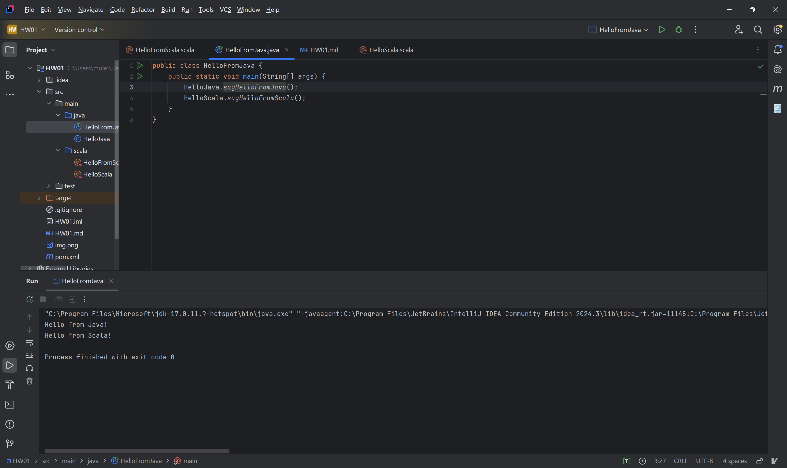
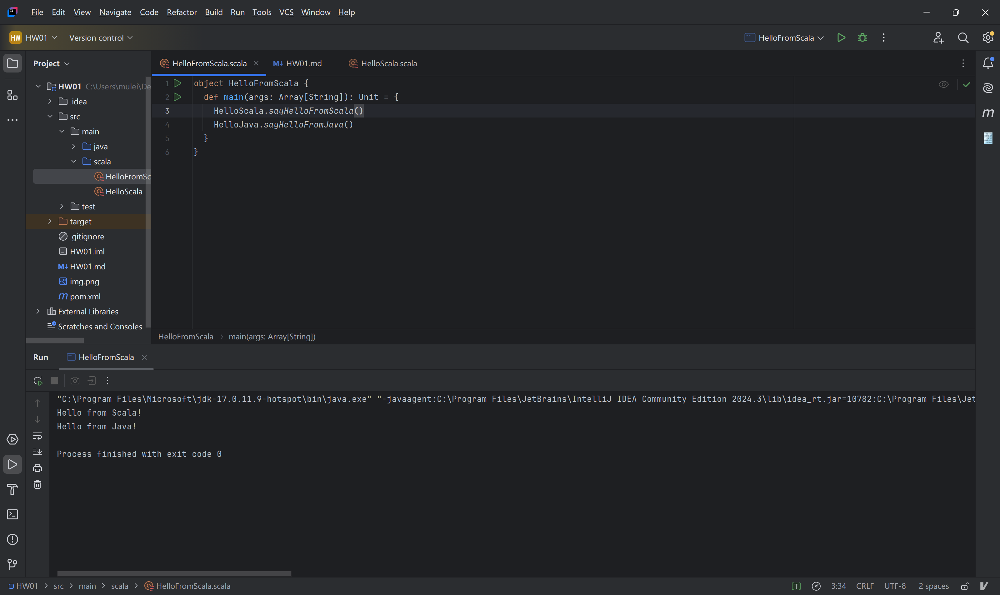

# HW01 Java 和 Scala 混合编程任务
## 运行结果


## 实现方法
我的scala使用了单例对象的方法创建类。这样避免了实例化对象，也是scala的入口main所存放的地方。
scala中的
```scala
object HelloScala {
  def sayHelloFromScala(): Unit = {
    println("Hello from Scala!")
  }
}
```
实际上类似于java中的
```java
public class HelloJava {
   public static final HelloJava INSTANCE = new HelloJava();
   private HelloJava() {}
   public void sayHelloFromJava() {
      System.out.println("Hello from Java!");
   }
}
```

## 字节码的基础
`L0`表示方法调用时开始的位置，`L1`表示RETURN的时候的位置，如果是Release编译就不会生成

`public <init>()V`表示构造函数

`V`表示void。

`LINENUMBER`表示行号和字节码的对应关系，如果是Release编译就不会生成

`INVOKExxx`调用xxx类型的函数

`MAXSTACK`最大的堆栈操作深度

`MAXLOCALS`最大的局部变量数量

## HelloJava.java
```java
// class version 52.0 (52)
// access flags 0x21
public class HelloJava {

  // compiled from: HelloJava.java

  // access flags 0x1
  public <init>()V
   L0
    LINENUMBER 1 L0
    ALOAD 0
    INVOKESPECIAL java/lang/Object.<init> ()V
    RETURN
   L1
    LOCALVARIABLE this LHelloJava; L0 L1 0
    MAXSTACK = 1
    MAXLOCALS = 1

  // access flags 0x9
  public static sayHelloFromJava()V
   L0
    LINENUMBER 3 L0
    GETSTATIC java/lang/System.out : Ljava/io/PrintStream;
    LDC "Hello from Java!"
    INVOKEVIRTUAL java/io/PrintStream.println (Ljava/lang/String;)V
   L1
    LINENUMBER 4 L1
    RETURN
    MAXSTACK = 2
    MAXLOCALS = 0
}
```

`ALOAD 0`表示加载0位置的变量，即是下面这个this

`LOCALVARIABLE this LHelloJava; L0 L1 0`表示this是一个LHelloJava的对象，用于调试器的反汇编，所以说如果是Release编译的话就不会生成啦。

`INVOKESPECIAL java/lang/Object.<init> ()V`表示将对this使用Object（父类）的构造函数。


后面的就是获取输出流对象，再将你好java打印出来。

## HelloScala.scala
```java
// class version 52.0 (52)
// access flags 0x31
public final class HelloScala$ {

  // compiled from: HelloScala.scala

  ATTRIBUTE Scala : unknown

  ATTRIBUTE ScalaInlineInfo : unknown

  // access flags 0x19
  public final static LHelloScala$; MODULE$

  // access flags 0x9
  public static <clinit>()V
   L0
    LINENUMBER 1 L0
    NEW HelloScala$
    DUP
    INVOKESPECIAL HelloScala$.<init> ()V
    PUTSTATIC HelloScala$.MODULE$ : LHelloScala$;
    RETURN
    MAXSTACK = 2
    MAXLOCALS = 0

  // access flags 0x1
  public sayHelloFromScala()V
   L0
    LINENUMBER 3 L0
    GETSTATIC scala/Predef$.MODULE$ : Lscala/Predef$;
    LDC "Hello from Scala!"
    INVOKEVIRTUAL scala/Predef$.println (Ljava/lang/Object;)V
    RETURN
   L1
    LOCALVARIABLE this LHelloScala$; L0 L1 0
    MAXSTACK = 2
    MAXLOCALS = 1

  // access flags 0x2
  private <init>()V
   L0
    LINENUMBER 1 L0
    ALOAD 0
    INVOKESPECIAL java/lang/Object.<init> ()V
    RETURN
   L1
    LOCALVARIABLE this LHelloScala$; L0 L1 0
    MAXSTACK = 1
    MAXLOCALS = 1
}
```
这里和java的区别在于：

1. 单例对象在创建的时候需要是会用clinit标签中的初始化方法：创建HelloScala实例并将其储存在MODULE中。而且init的方法是private的，只在clinit中使用，而不可以在外部实例化。
2. scala中的println方法是使用的scala/Predef$.println方法而非System.out.println。不过二者的内部实现应该是一样的。
3. 有额外的ATTRIBUTTE信息，deepseek说这个是为了用来支持scala特性的

可以发现scala复杂很多，这是因为scala的特性更为复杂，所以想要使用JVM的指令集实现时会比原生的java更困难。

## HelloFromJava.java
```java
// class version 52.0 (52)
// access flags 0x21
public class HelloFromJava {

  // compiled from: HelloFromJava.java

  // access flags 0x1
  public <init>()V
   L0
    LINENUMBER 1 L0
    ALOAD 0
    INVOKESPECIAL java/lang/Object.<init> ()V
    RETURN
   L1
    LOCALVARIABLE this LHelloFromJava; L0 L1 0
    MAXSTACK = 1
    MAXLOCALS = 1

  // access flags 0x9
  public static main([Ljava/lang/String;)V
   L0
    LINENUMBER 3 L0
    INVOKESTATIC HelloJava.sayHelloFromJava ()V
   L1
    LINENUMBER 4 L1
    INVOKESTATIC HelloScala.sayHelloFromScala ()V
   L2
    LINENUMBER 5 L2
    RETURN
   L3
    LOCALVARIABLE args [Ljava/lang/String; L0 L3 0
    MAXSTACK = 0
    MAXLOCALS = 1
}
```

这个差不多都可以用之前的分析来解释了。

`    LOCALVARIABLE args [Ljava/lang/String; L0 L3 0`这个就是mian方法里面的String[] args。虽然没有使用但是还是出现了


## HelloFromScala.scala
```java
// class version 52.0 (52)
// access flags 0x31
public final class HelloFromScala$ {

  // compiled from: HelloFromScala.scala

  ATTRIBUTE Scala : unknown

  ATTRIBUTE ScalaInlineInfo : unknown

  // access flags 0x19
  public final static LHelloFromScala$; MODULE$

  // access flags 0x9
  public static <clinit>()V
   L0
    LINENUMBER 1 L0
    NEW HelloFromScala$
    DUP
    INVOKESPECIAL HelloFromScala$.<init> ()V
    PUTSTATIC HelloFromScala$.MODULE$ : LHelloFromScala$;
    RETURN
    MAXSTACK = 2
    MAXLOCALS = 0

  // access flags 0x1
  public main([Ljava/lang/String;)V
    // parameter final  args
   L0
    LINENUMBER 3 L0
    GETSTATIC HelloScala$.MODULE$ : LHelloScala$;
    INVOKEVIRTUAL HelloScala$.sayHelloFromScala ()V
   L1
    LINENUMBER 4 L1
    INVOKESTATIC HelloJava.sayHelloFromJava ()V
    RETURN
   L2
    LOCALVARIABLE this LHelloFromScala$; L0 L2 0
    LOCALVARIABLE args [Ljava/lang/String; L0 L2 1
    MAXSTACK = 1
    MAXLOCALS = 2

  // access flags 0x2
  private <init>()V
   L0
    LINENUMBER 1 L0
    ALOAD 0
    INVOKESPECIAL java/lang/Object.<init> ()V
    RETURN
   L1
    LOCALVARIABLE this LHelloFromScala$; L0 L1 0
    MAXSTACK = 1
    MAXLOCALS = 1
}

```
相比于调用java，调用scala的函数就需要先

    GETSTATIC HelloScala$.MODULE$ : LHelloScala$;

这个调用的方式和Scala中使用println的时候也需要先

    GETSTATIC scala/Predef$.MODULE$ : Lscala/Predef$;

的本质是一样的。本质上这是因为实例化单例对象的时候将其储存在MODULE中了。

## 如果使用release编译
在 Additional command line parameters 中，输入-g:none

对于观察会友好很多，但是我在之前没想到这件事情……
```java
// class version 52.0 (52)
// access flags 0x21
public class HelloJava {


   // access flags 0x1
   public <init>()V
   ALOAD 0
   INVOKESPECIAL java/lang/Object.<init> ()V
           RETURN
   MAXSTACK = 1
   MAXLOCALS = 1

   // access flags 0x9
   public static sayHelloFromJava()V
   GETSTATIC java/lang/System.out : Ljava/io/PrintStream;
   LDC "Hello from Java!"
   INVOKEVIRTUAL java/io/PrintStream.println (Ljava/lang/String;)V
           RETURN
   MAXSTACK = 2
   MAXLOCALS = 0
}

```
## Java 和 Scala 混合编程的实现方式
二者混合编程的基础是都可以编译为JVM的字节码。

混合编程下，可以使用到scala支持的函数式编程范式，也可以调用java丰富的第三方库。

但是，二者相互操作的复杂度会比较高，过度耦合可能导致项目难以管理。而且从性能上可能也不如只使用java进行开发。

## Refer to DeepSeek

在 IntelliJ IDEA 中使用 Java 和 Scala 进行混合编程的步骤如下：

### 1. 安装 Scala 插件

1. 打开 IntelliJ IDEA。
2. 进入 `File` -> `Settings`（Windows/Linux）或 `IntelliJ IDEA` -> `Preferences`（macOS）。
3. 选择 `Plugins`，搜索 `Scala` 并安装。

### 2. 创建项目

1. 选择 `File` -> `New` -> `Project`。
2. 选择 `Maven` 或 `Gradle` 作为构建工具。
3. 在项目创建向导中，勾选 `Create from archetype`，选择 `scala-archetype-simple`（Maven）或 `scala/hello-world.g8`（Gradle）。
4. 完成项目创建。

### 3. 配置项目结构

1. 进入 `File` -> `Project Structure`。
2. 在 `Modules` 选项卡中，确保 `src/main/java` 和 `src/main/scala` 目录已标记为 `Sources`。
3. 如果目录不存在，手动创建并标记。

### 4. 添加依赖

#### Maven

在 `pom.xml` 中添加 Scala 依赖：

```xml

<dependencies>
    <dependency>
        <groupId>org.scala-lang</groupId>
        <artifactId>scala-library</artifactId>
        <version>2.13.10</version>
    </dependency>
</dependencies>
```

#### Gradle

在 `build.gradle` 中添加 Scala 依赖：

```groovy
dependencies {
    implementation 'org.scala-lang:scala-library:2.13.10'
}
```

### 总结

通过以上步骤，你可以在 IntelliJ IDEA 中轻松实现 Java 和 Scala 的混合编程。