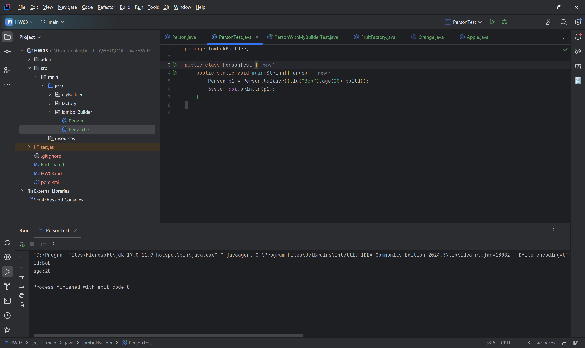
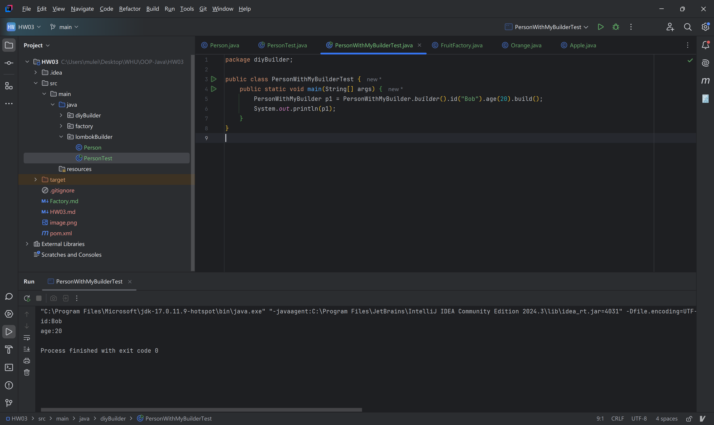

# HW03 对象创建模式与Lombok应用
## 1. 使用Lombok的@Builder注解实现的代码文件。
Person.java
```java
package lombokBuilder;

import lombok.Builder;

@Builder
public class Person {
    private String id;
    private int age;

    @Override
    public String toString() {
        return "id:" + id + "\n" + "age:" + age;
    }
}
```

PersonTest.java
```java
package lombokBuilder;

public class PersonTest {
    public static void main(String[] args) {
        Person p1 = Person.builder().id("Bob").age(20).build();
        System.out.println(p1);
    }
}
```
运行结果：


## 2. 自己编写的Builder实现代码文件。
PersonWithMyBuilder.java
```java
package diyBuilder;

public class PersonWithMyBuilder {
    private String id;
    private int age;

    PersonWithMyBuilder(String id, int age) {
        this.id = id;
        this.age = age;
    }

    @Override
    public String toString() {
        return "id:" + id + "\n" + "age:" + age;
    }

    public static PersonBuilder builder() {
        return new PersonBuilder();
    }

    public static class PersonBuilder {
        private String id;
        private int age;

        PersonBuilder() {
        }

        public static PersonBuilder builder() {
            return new PersonBuilder();
        }

        public PersonBuilder id(String id) {
            this.id = id;
            return this;
        }

        public PersonBuilder age(int age) {
            this.age = age;
            return this;
        }

        public PersonWithMyBuilder build() {
            return new PersonWithMyBuilder(this.id, this.age);
        }
    }
}
```

PersonWithMyBuilderTest.java
```java
package diyBuilder;

public class PersonWithMyBuilderTest {
    public static void main(String[] args) {
        PersonWithMyBuilder p1 = PersonWithMyBuilder.builder().id("Bob").age(20).build();
        System.out.println(p1);
    }
}

```

运行结果：


## 3. 反汇编分析报告，展示手动实现的Builder与Lombok自动生成的代码对比。
Lombok自动生成的：
```java
package lombokBuilder;

import lombok.Generated;

public class Person {
    private String id;
    private int age;

    public String toString() {
        return "id:" + this.id + "\nage:" + this.age;
    }

    @Generated
    Person(String var1, int var2) {
        this.id = var1;
        this.age = var2;
    }

    @Generated
    public static PersonBuilder builder() {
        return new PersonBuilder();
    }

    @Generated
    public static class PersonBuilder {
        @Generated
        private String id;
        @Generated
        private int age;

        @Generated
        PersonBuilder() {
        }

        @Generated
        public PersonBuilder id(String var1) {
            this.id = var1;
            return this;
        }

        @Generated
        public PersonBuilder age(int var1) {
            this.age = var1;
            return this;
        }

        @Generated
        public Person build() {
            return new Person(this.id, this.age);
        }

        @Generated
        public String toString() {
            return "Person.PersonBuilder(id=" + this.id + ", age=" + this.age + ")";
        }
    }
}

```
手动实现的：
```java

package diyBuilder;

public class PersonWithMyBuilder {
    private String id;
    private int age;

    PersonWithMyBuilder(String var1, int var2) {
        this.id = var1;
        this.age = var2;
    }

    public String toString() {
        return "id:" + this.id + "\nage:" + this.age;
    }

    public static PersonBuilder builder() {
        return new PersonBuilder();
    }

    public static class PersonBuilder {
        private String id;
        private int age;

        PersonBuilder() {
        }

        public static PersonBuilder builder() {
            return new PersonBuilder();
        }

        public PersonBuilder id(String id) {
            this.id = id;
            return this;
        }

        public PersonBuilder age(int age) {
            this.age = age;
            return this;
        }

        public PersonWithMyBuilder build() {
            return new PersonWithMyBuilder(this.id, this.age);
        }
    }
}

```

对比：二者几乎完全一致，反汇编的代码中含有`@Generated`的注解。在字节码中为：
```
@Llombok/Generated;() // invisible
```
Lombok生成的Builder也重写了toString函数，而我自己的版本忘记了做这件事情。可见使用Lombok可以事半功倍的完成复杂对象的构建方法的编写。
## 4. 创建型设计模式（简单工厂或工厂方法）的代码实现文件。

FoodFactoryMethod.java
```java
package factory;

interface Food {
    void use();
}

class Rice implements Food {
    @Override
    public void use() {
        System.out.println("Using Food A");
    }
}

class Noodle implements Food {
    @Override
    public void use() {
        System.out.println("Using Food B");
    }
}

interface Factory {
    Food createProduct();
}

class FactoryRice implements Factory {
    @Override
    public Food createProduct() {
        return new Rice();
    }
}

class FactoryNoodle implements Factory {
    @Override
    public Food createProduct() {
        return new Noodle();
    }
}

public class FoodFactoryMethod {
    public static void main(String[] args) {
        Factory factoryA = new FactoryRice();
        Food productA = factoryA.createProduct();
        productA.use();  // 输出: Using Food A

        Factory factoryB = new FactoryNoodle();
        Food productB = factoryB.createProduct();
        productB.use();  // 输出: Using Food B
    }
}
```

FruitSimpleFactory.java
```java
package factory;

// interface
interface Fruit {
    void use();
}

// A
class Apple implements Food {
    @Override
    public void use() {
        System.out.println("Apple");
    }
}

// B
class Banana implements Food {
    @Override
    public void use() {
        System.out.println("Banana");
    }
}

// 简单工厂类
class SimpleFactory {
    public static Food createProduct(String type) {
        if (type.equals("A")) {
            return new Apple();
        } else if (type.equals("B")) {
            return new Banana();
        } else {
            throw new IllegalArgumentException("Unknown product type");
        }
    }
}

public class FruitSimpleFactory {
    public static void main(String[] args) {
        Food fruitA = SimpleFactory.createProduct("A");
        fruitA.use();

        Food fruitB = SimpleFactory.createProduct("B");
        fruitB.use();
    }
}
```

## 5. 至少一篇300字的学习心得，讨论设计模式和Lombok应用的学习收获。

语言的设计模式是一种规范，在简单工厂中：可以通过一个工厂类来创建不同类型的对象，使用的时候只需要知道工厂类即可。在工厂方法中：定义有一个创建对象的接口，由子类决定实例化哪个类。工厂方法模式将对象的创建推迟到子类。两种用于创建对象的设计模式都将对象的创建与使用的过程完成了解耦，使得代码更加易于维护，通过复用工厂类与接口，也提高了代码的可扩展性。

对比简单工厂和工厂方法两种设计模式，可以发现，简单工厂创建的对象全部依赖于一个工厂类，所以扩展时，需要更改工厂类，工厂类的职责较大，故较难以扩展，适用于类的数量较少的使用场景。而工厂方法类对所创建的各个对象都是用了不同的工厂类，这使得类的数量较多，但工厂类的职责较小，较为易于扩展，适用于类的数量较多的使用场景。

在使用面向对象编程语言的时候，由于常常需要重复编写类的创建函数，而创建的过程可能较为复杂，不适合全部写在构造函数之中，所以使用`Lombok`的`@Builder`注解可以高效的完成类的构建器，可以使用链式调用的方式来初始化对象。链式调用的初始化过程深刻的展现了面向对象编程的过程中，调用函数本身也是一种对于对象`this`的传递。